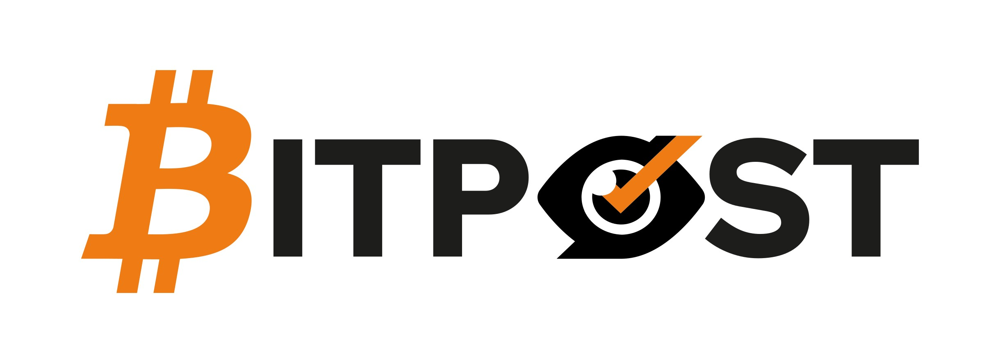
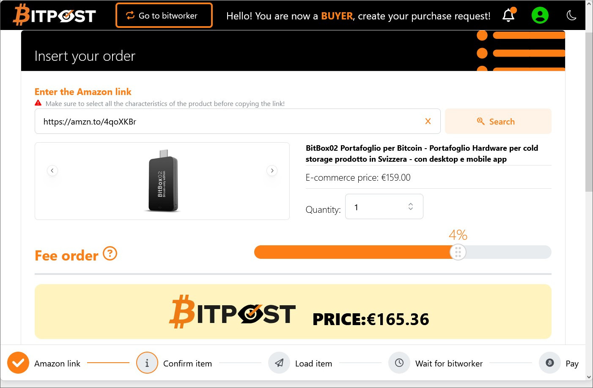
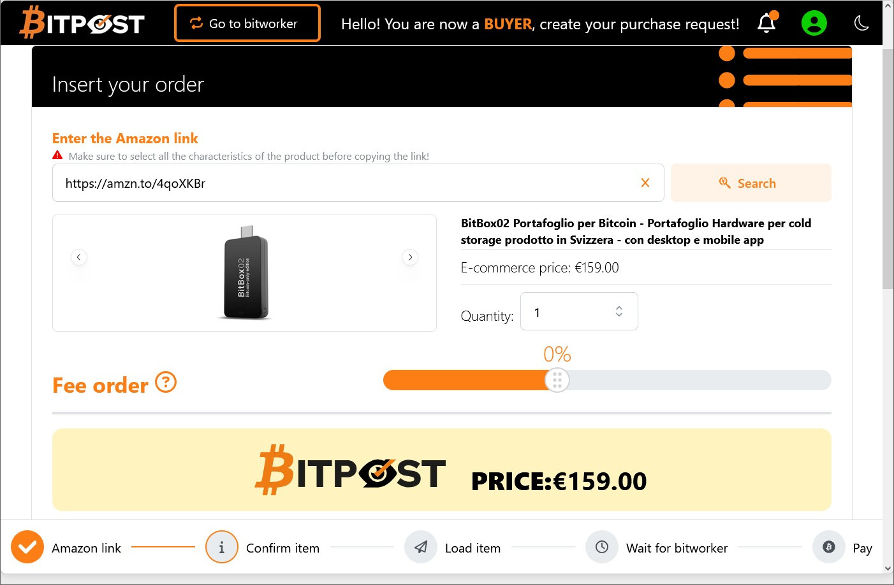
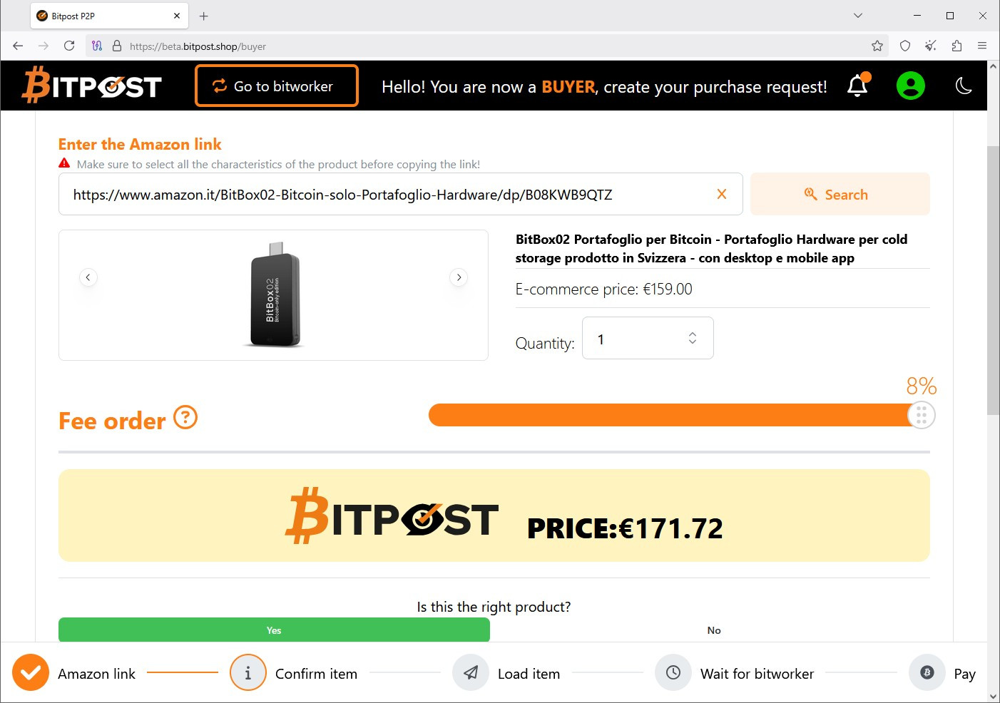
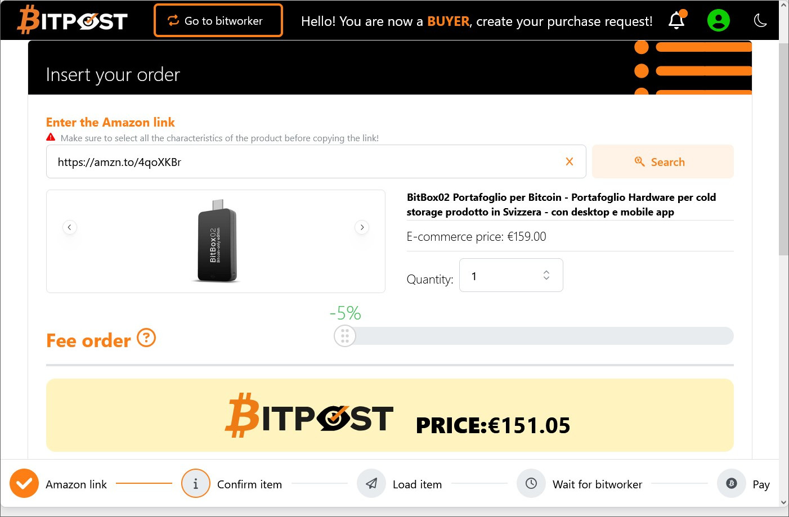

# Bitpost e le fee

:link:[**BitPost**](https://www.bitpost.shop) è un progetto nato dalla mente di *Zio Satoshi*.

## Due parole su BitPost
Per chi fosse capitato su queste pagine casualmente, spiego brevemente in cosa consiste :link:[**BitPost**](https://www.bitpost.shop).

*Zio Satoshi* ha scoperto che il mercato aveva delle esigenze che nessuno, fino ad ora, era riuscito a risolvere. 
Da un lato troviamo utenti con le seguenti necessità:

1. **L'acquisto di beni in totale privacy** e in modo pseudonimo
2. **L'acquisto di beni utilizzando bitcoin**

E dall'altro utenti che vogliono acquistare bitcoin in maniera *non KYC* e senza esporsi a rischi.

**BitPost** è nato per mettere in contatto queste due tipologie di utenti.

Il primo tipo di utenti, sulla piattaforma viene chiamato **buyer** 
La seconda tipologia di utenti, invece, viene definito **bitworker**.

Lo staff di **BitPost**, lavorando strenuamente, ha definito un flusso di lavoro che permette di effettuare tutto con un alto livello di privacy e in maniera pseudonima.

Il tutto avviene in maniera automatica e la piattaforma interviene solo nella malaugurata ipotesi in cui nasca una controversia che non viene risolta di comune accordo tra le parti.

## I dubbi
Recentemente, *Zio Satoshi* ha tenuto una *live* in cui presentava la piattaforma di **BitPost**. 
Dalle domande emerse in *live*, dai messaggi sul gruppo e anche dalle domande che mi hanno posto durante un SatoshiSpritz, ho compreso che il punto su cui si fa più confusione sono le *fee* che verranno applicate.  
Spero con questo scritto di chiarire il tutto.

# Le Fee
La piattaforma **BitPost**, per potersi mantenere, chiede una *fee* dell'8% sulla transazione. 
Queste *fee* possono essere pagate da una o da entrambe le parti. 
In questo testo, voglio appunto mostrare le varie casistiche.

1. [Scenario SHA](#Scenario-con-fee-condivise) ovvero *fee* equamente condivise;
2. [Scenario Standard](#Scenario-Standard)
3. [Scenario **buyer** con necessità di urgenza](#Scenario-Buyer-Frettoloso)
4. [Scenario con **buyer** molto esoso](#Scenario-Buyer-Esoso)

Di seguito ci sarà anche una [analisi di questi scenari](#Analisi-Scenari).

## Scenario con *fee* condivise
Ipotizziamo che il **buyer** voglia comprare, ad esempio, un :link:[BitBox02](https://amzn.to/4qoXKBr) e che quindi (giustamente) lo voglia fare in maniera pseudonima. 
Il **buyer** andrà sulla piattaforma di **BitPost** e inserirà il link del BitBox02.

Nell'immagine potete vedere tre dati molto importanti:
* Il prezzo di vendita dell'oggetto, ovvero € 159,00
* Il *Fee Order* di questa transazione che in questo caso è impostato a 4%
* Il prezzo finale che il **buyer** andrà a pagare. Avendo impostato le *fee* al 4%, il **buyer** pagherà l'oggetto in questione con una maggiorazione del 4% ovvero € 165,36 [^1].

Dopo che il **buyer** avrà caricato questa transazione, aspetterà di trovare un **bitworker** che la prenda in carico ed esegua tutti i passaggi necessari ad arrivare alla fine della transazione. 
Un volta che il **buyer** avrà indicato alla piattaforma di aver ritirato l'oggetto integro, il **bitworker** potrà riscattare il suo pagamento in satoshi.

In questo caso, avendo il **buyer** indicato 4% come *fee order*, ha già pagato il 4% delle *fee* ed il restante 4% spetterà al **bitworker** Vediamo quanto spetterà al **bitworker**:

*  ``€ 159,00 - 4% = € 152,89``  [^1] [^2]

## Scenario Standard

Ipotizziamo che il **buyer** di prima, che vuole il BitBox02, non voglia pagare *fee*, ma che voglia acquistare l'oggetto pagandolo esattamente quanto è venduto da Amazon. 
Ecco come il **buyer** inserirà l'annuncio andrà sulla piattaforma.

Andiamo ad analizzare i tre dati molto importanti:
* Il prezzo di vendita dell'oggetto, ovvero € 159,00 (stesso oggetto, stesso prezzo);
* Il *Fee Order* di questa transazione che in questo caso è impostato a 0%
* Il prezzo finale che il **buyer** andrà a pagare che in questo caso rimane € 159,00 [^1].

Vediamo cosa accadrà in questo scenario quando la transazione sarà ultimata.

In questo caso, avendo il **buyer** indicato 0% come *fee order*, sarà il **bitworker** a dover pagare tutte le *fee* Vediamo quindi quanto spetterà al **bitworker**:

* ``€ 159,00 - 8% = € 146,28`` [^1] [^2]

## Scenario Buyer Frettoloso
Il nostro **buyer**  ha veramente fretta di ricevere il suo BitBox, così decide di accollarsi lui tutte le *fee* in modo da incentivare un **bitworker** a prendere in carico il suo acquisto il più presto possibile.

Quando caricherà l'oggetto sulla piattaforma, lo farà in questo modo:

Andiamo ad analizzare i soliti tre dati molto importanti:
* Il prezzo di vendita dell'oggetto, ovvero € 159,00 (stesso oggetto, stesso prezzo);
* Il *Fee Order* di questa transazione che in questo caso è impostato a **+8%**
* Il prezzo finale che il **buyer** andrà a pagare che in questo caso sale a € 171,72[^1].

In questo caso, il **buyer** ha deciso di accollarsi tutte le *fee* ed una volta completata la transazione, il **bitworker** incasserà il controvalore totale dell'oggetto acquistato:

* ``€ 159,00 - 0% = € 159,00`` [^1]

## Scenario Buyer Esoso

Ipotizziamo che il **buyer** di prima, che vuole sempre il BitBox02, possa fare alcuni ragionamenti del tipo:
* Chi riceverà bitcoin avrà un vantaggio futuro come riserva di valore;
* Il controvalore è molto basso, non posso rimetterci troppo;
* Qualsiasi cosa passi per la testa di un **buyer**

Facendo simili pensieri, il **buyer**, potrebbe decidere di essere *Esoso*, e di provare ad acquistare l'oggetto scontato rispetto al prezzo di vendita non avendo fretta di riceverlo.

Per questi scenari, la piattaforma, permette di caricare un ordine di acquisto con *uno sconto massimo del 5%*. 
In questo esempio mostrerò appunto questo caso limite:

Guardiamo ancora una volta i tre dati molto importanti:
* Il prezzo di vendita dell'oggetto, ovvero € 159,00 (stesso oggetto, stesso prezzo);
* Il *Fee Order* di questa transazione che in questo caso è impostato a **-5%**
* Il prezzo finale che il **buyer** andrà a pagare che in questo caso scende a € 151,05. [^1]

In questo scenario, il **buyer** sta chiedendo al **bitworker** non solo di pagare le *fee* della piattaforma, ma anche una sua *fee* personale.

Ammesso di trovare un **bitworker** che accetti di prendere in carico questa transazione, andiamo a vedere cosa accadrà alla sua ricompensa:

>*fee piattaforma*  
il **bitworker** dovrà sempre pagare l'8% di *fee* alla piattaforma, queste *fee* verranno calcolate sul valore originale del prodotto quindi: 
 * `8 di € 159 = € 12,72` [^1] [^2]
> Queste *fee* verranno sottratte dalla cifra versata dal **buyer** 
Al termine di questa transazione, il **bitworker** potrà quindi riscattare quanto segue: 
* `€ 151,05 - € 12,72 = € 138,99` [^1] [^2] 
> In questo caso, il **bitworker** pagherà il 13% di *fee*

## Analisi Scenari
Sopra ho riportato gli scenari che si possono trovare su BitPost portandoli al **limite massimo**.

Se un **buyer** inserirà un ordine con [Scenario con **buyer** esoso](#Scenario-Buyer-Esoso), avrà più difficoltà a trovare un **bitworker** disposto a prendersi carico del suo ordine, ma se qualcuno si farà avanti,potrà portarsi a casa un oggetto scontato.

Nel caso opposto, invece, quanto verrà caricato un ordine con [Scenario **buyer** Frettoloso](#Scenario-Buyer-Frettoloso), sarà molto probabile che in pochissimo tempo un **bitworker** porterà a termine l'incarico.

Non è mio interesse dirvi quale scenario adottare durante l'uso di **BitPost**, ma, utilizzando quanto descritto, potrete valutate le vostre esigenze e le vostre necessità.

| | |
| :------- | :--------: |
|  Per avere maggiori informazioni su BitPost, vi invito ad unirvi al canale ufficiale su Telegram. Nel canale potrete leggere tutte le novità e gli aggiornamenti che ci saranno sulla piattaforma. Dal canale potrete poi accedere ad una chat di supporto in cui potrete interagire direttamente con ZioSatoshi e con lo staff di BitPost.|  |
---
[^1]: Il valore è indicato in Euro, ma verrà pagato/erogato in sats.

[^2]: Valori arrotondati per semplicità
